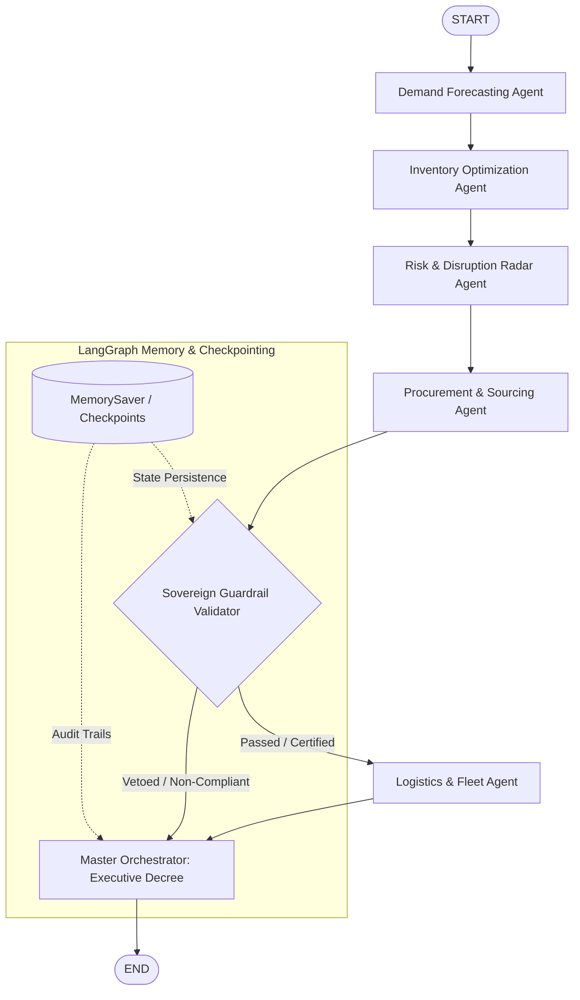

# Sovereign Supply Chain Multi-Agent System (MAS)

[](https://www.python.org/downloads/)
[](https://langchain-ai.github.io/langgraph/)
[](https://python.langchain.com/)
[]()
[](LICENSE)

An enterprise-grade, autonomous **Multi-Agent System (MAS)** for predictive, resilient supply chain management under strict **sovereign state constraints** (national strategic reserves, public procurement laws, trade embargos, and emergency decrees). 

Engineered strictly following the official documentation of **LangGraph** (`StateGraph`, `MemorySaver`, conditional edges, message reducers) and **LangChain** (`@tool` decorator with explicit Pydantic `args_schema`, `BaseMessage` channels, and ChatModels).

---

## System Architecture

The system models decision-making through **7 specialized agent nodes**, an explicit **Sovereign Guardrail validation node**, and **conditional routing edges**:



---

## 👥 The 7 Specialized Agents

| # | Agent Name | Node Identifier | Core Responsibility |
| :---: | :--- | :--- | :--- |
| **1** | **Demand Forecasting** | `demand_agent` | Evaluates consumption signals, detects crisis anomalies, and computes 7-day requirements. |
| **2** | **Inventory Optimization** | `inventory_agent` | Computes Reorder Points (ROP), Safety Stock, and alerts if stock falls below the **500-unit State Strategic Reserve Floor**. |
| **3** | **Risk & Disruption Radar** | `risk_agent` | Scans external threat intelligence (weather storms, port strikes, geopolitical embargoes). |
| **4** | **Procurement & Sourcing** | `procurement_agent` | Evaluates vendor catalogs, integrates risk delays, and submits ranked quotation proposals. |
| **5** | **Sovereign Compliance & State** | `compliance_guardrail` | **Enforces public policy, trade sanctions, spending caps, and holds statutory VETO power.** |
| **6** | **Logistics & Fleet** | `logistics_agent` | Allocates security-certified carriers (Air Express, Road, Rail) and computes freight transit schedules. |
| **7** | **Master Orchestrator** | `orchestrator_agent` | Balances trade-offs (sovereignty vs. cost vs. speed) and signs the legally binding **Executive Decree**. |

---

## 🛡️ LangGraph Guardrails Suite

Guardrails are implemented as first-class validation checks and conditional edges inside the graph:

1. **Strategic Reserve Floor Guardrail (`strategic_reserve_guardrail.py`)**:
   - Enforces statutory floor: **500 units minimum** must remain in warehouse at all times.
   - Any replenishment order that allows net projected stock to drop below 500 units triggers a critical breach and mandates fast-track replenishment.
2. **Public Procurement Budget Guardrail (`procurement_budget_guardrail.py`)**:
   - Standard peacetime spending cap: **100,000.00 EUR**.
   - Public emergency ceiling: **250,000.00 EUR** (activated when strategic reserves are threatened within 72 hours).
   - Flagging and audit trail for sole-source justifications over 25,000.00 EUR.
3. **Sovereign Embargo & Sanctions Guardrail (`embargo_sanction_guardrail.py`)**:
   - Immediate **VETO** if a vendor originates from a sanctioned jurisdiction (`EMBARGO_LAND`, uncertified offshore territories).
   - Enforces mandatory state security certification (`certified_by_state == True`).

---

## 🔧 Official LangChain `@tool` Suite

All deterministic calculation engines are built as official LangChain `BaseTool` instances using the `@tool(args_schema=...)` decorator:

```python
from langchain_core.tools import tool
from pydantic import BaseModel, Field

class DemandForecastInput(BaseModel):
    sku: str = Field(description="Unique strategic product SKU identifier")
    historical_consumption: list[int] = Field(description="Recent daily consumption units")
    growth_multiplier: float = Field(default=1.0, description="Macro-economic trend factor")
    emergency_shock_factor: float = Field(default=0.0, description="Crisis surge factor")

@tool(args_schema=DemandForecastInput)
def calculate_demand_forecast_tool(sku: str, ...) -> dict:
    """Calculate statistical demand projections and detect consumption anomalies."""
```

### Available Tools:
* `calculate_demand_forecast_tool`: Statistical moving average and anomaly surge calculation.
* `calculate_inventory_metrics_tool`: Reorder Point ($ROP = d \cdot L + SS$), days of supply, and reserve breach audits.
* `query_risk_radar_tool`: Real-time external intelligence feed scan.
* `evaluate_supplier_proposals_tool`: Vendor catalog query with disruption lead-time adjustments.
* `plan_freight_dispatch_tool`: Certified fleet allocation and transit calculation.

---

## 💾 State Persistence & Memory

The workflow uses `langgraph.checkpoint.memory.MemorySaver`:
* Each crisis workflow execution runs under a distinct `thread_id` (e.g. `crisis-thread-20260915-1953`).
* Complete audit history (`agent_logs`) and multi-agent conversations (`messages: Annotated[list[BaseMessage], add_messages]`) are persisted across steps and can be inspected, resumed, or rewound at any checkpoint.

---

## 🚀 Quickstart Guide

### 1. Prerequisites & Virtual Environment
```bash
# Clone the repository
git clone git@github.com:Youssef-Laaroussi/multi-agent-supply-chain-system.git
cd multi-agent-supply-chain-system

# Create and activate virtual environment 'ylenv'
python3 -m venv ylenv
source ylenv/bin/activate
```

### 2. Install Dependencies
```bash
pip install -r requirements.txt
```

### 3. Environment Variables (Optional for Live LLM)
Copy the template file:
```bash
cp .env.example .env
```
* **Offline / Demo Mode (Default):** Runs with deterministic intelligent reasoning without needing external API keys.
* **Live LLM Mode:** Set `OPENAI_API_KEY=sk-...` and `LLM_MODE=live` to bind agents to live OpenAI GPT-4o models.

### 4. Run the Multi-Agent Interactive Simulation
```bash
python -m src.supply_chain.main
```

### 5. Run Automated Tests
```bash
python -m pytest -v tests/
```

---

## 📁 Repository Structure

```
multi-agent-supply-chain-system/
├── ylenv/                               # Python Virtual Environment
├── .gitignore                           # Git ignore configuration
├── .env.example                         # Environment configuration template (DeepSeek, OpenAI, LangSmith)
├── requirements.txt                     # Project dependencies
├── README.md                            # Complete self-contained documentation
├── reports/                             # Statutory JSON audit reports & SQLite checkpoints
├── tests/
│   └── test_supply_chain.py             # Pytest automated test suite (14/14 passing)
└── src/
    └── supply_chain/
        ├── __init__.py
        ├── config.py                    # Strategic reserve floors, catalogs, thresholds
        ├── state.py                     # Official LangGraph TypedDict & add_messages
        ├── llm.py                       # LangChain ChatModel factory (DeepSeek, OpenAI, Mock)
        ├── reports.py                   # Statutory crisis decree & JSON audit exporter
        ├── memory/                      # State persistence & checkpointer factory
        │   ├── __init__.py
        │   └── checkpointer.py          # MemorySaver & SqliteSaver backends
        ├── schemas/                     # Strict Pydantic output validation models
        │   ├── __init__.py
        │   └── outputs.py               # Domain schemas for all 7 agent outputs
        ├── prompts/                     # Role-specialized system prompts
        │   └── __init__.py
        ├── guardrails/                  # Sovereign guardrails & validator node
        │   ├── __init__.py
        │   ├── strategic_reserve_guardrail.py
        │   ├── procurement_budget_guardrail.py
        │   ├── embargo_sanction_guardrail.py
        │   └── validator_node.py        # Official LangGraph guardrail node
        ├── tools/                       # Official LangChain @tool suite
        │   ├── __init__.py
        │   ├── forecasting_tools.py
        │   ├── inventory_tools.py
        │   ├── supplier_tools.py
        │   ├── logistics_tools.py
        │   └── risk_radar_tools.py
        ├── agents/                      # 7 Agent nodes
        │   ├── __init__.py
        │   ├── demand_agent.py
        │   ├── inventory_agent.py
        │   ├── risk_agent.py
        │   ├── procurement_agent.py
        │   ├── compliance_agent.py
        │   ├── logistics_agent.py
        │   └── orchestrator_agent.py
        ├── graph.py                     # StateGraph compilation & checkpointer binding
        └── main.py                      # Interactive Rich CLI simulation runner
```

---

## 📜 License
MIT License - Developed for autonomous, resilient public sector supply chain governance.
